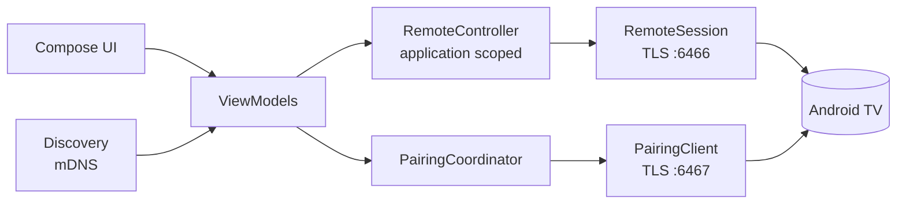

# Free TV Remote

**Turn your Android phone into a fast, beautiful remote for Android TV and Google TV.**
Free. Open source. No ads, no account, no cloud, no tracking.

[**⬇ Download**](#-download) ·
[Features](#-why-you-will-like-it) ·
[Compatibility](#-compatibility-at-a-glance) ·
[How it works](docs/ARCHITECTURE.md) ·
[All docs](docs/README.md)

---

> [!IMPORTANT]
> ### ✅ Works today: **an Android phone + an Android TV / Google TV**
> Verified by the maintainer on a **TCL Google TV** with an Android phone: pairing, connecting, navigating,
> volume and the live status card. This was a hands-on check, **not** the full hardware checklist, which has not
> been completed yet (see [TESTING.md](TESTING.md)).
>
> **Not supported:** LG (webOS) and Samsung (Tizen) TVs. They are not Android TV and speak different protocols
> that this app does not implement. They are on the [roadmap](#-roadmap) to investigate, not promised.
> Details: [docs/COMPATIBILITY.md](docs/COMPATIBILITY.md).

## ⬇ Download

### **[Download the latest APK (v0.1.8)](https://github.com/tomerar/free-tv-remote/releases/download/v0.1.8/FreeTVRemote-v0.1.8.apk)**

[All releases](https://github.com/tomerar/free-tv-remote/releases/latest) ·
[Install guide](docs/INSTALL.md) ·
[Changelog](https://github.com/tomerar/free-tv-remote/releases)

Open the file on your Android phone (8.0 or newer), allow *install unknown apps* if Android asks, tap **Install**.

> [!WARNING]
> Early releases are signed with a **one-off key**, so Android cannot update them in place: **uninstall the old
> version before installing a new one** (your saved TVs are removed with it). This ends when a permanent project
> key is set up. Details: [docs/INSTALL.md](docs/INSTALL.md#updating-and-the-v010-limitation).

## ✨ Why you will like it

| | |
| :--- | :--- |
| 🎯 **A real remote** | Circular D-pad with OK, haptics and hold-to-repeat; Back, Home, Menu, volume, mute, power and media keys |
| 🔍 **Finds your TV** | Tap *Search for TVs*: a bounded 15-second search with a progress bar, or type the IP address |
| 🔐 **Pair once** | Enter the 6-character code from the TV. The TV's certificate is pinned, so nothing can pose as it |
| 📊 **Live status card** | One line: connection · TV on/off · volume · current app. Tap for model, volume bar, address and more |
| ⌨️ **Type on the TV** | Write on the phone keyboard, send to the TV; your text is kept if sending fails |
| 🚀 **App shortcuts** | Netflix, YouTube, Disney+, Prime Video and your own deep links |
| 🎨 **Looks native** | Material You colors from your wallpaper, system light/dark theme, large touch targets |
| 📺 **Several TVs** | Save as many as you like and switch in one tap |
| ⚡ **Tile and widget** | Quick Settings tile and home-screen widget for power and volume |
| 🛡 **Private by design** | Talks only to your TV on your Wi-Fi. No analytics, no cloud, no Google Play Services |
| 🌍 **Hebrew and English** | Full right-to-left support; the D-pad always stays physically correct |
| 🩺 **Built-in diagnostics** | Copy or share an app log (no secrets in it) to report a problem in seconds |

More detail on every feature: [docs/FEATURES.md](docs/FEATURES.md).

## 🚀 Pair in three steps

1. Put the phone and the TV on the **same Wi-Fi** and switch the TV on. Open the app and tap **Search for TVs**.
2. Pick your TV. It shows a **6-character code**: type it in the app.
3. Done. The app remembers the TV and reconnects by itself next time.

On Android 17 and newer, Android asks you to allow access to devices on your local network. The app cannot work
without it.

## 🧭 Compatibility at a glance

| | Status |
| :--- | :--- |
| **TCL Google TV** + Android phone | ✅ Works (maintainer-tested: pairing, navigation, volume, status) |
| Other Android TV / Google TV (Sony, Philips, Xiaomi, NVIDIA Shield, Chromecast with Google TV…) | ⏳ Expected to work (same protocol), **not yet tested** |
| LG webOS TV | ❌ Not supported (different platform and protocol) |
| Samsung Tizen TV | ❌ Not supported (different platform and protocol) |
| iPhone | ❌ Android app only |

Tested something? Add your device with the
[compatibility report](../../issues/new?template=device_compatibility.yml). The full table and the reasons are in
[docs/COMPATIBILITY.md](docs/COMPATIBILITY.md).

## 🎯 Design principles

The look will keep evolving; these rules will not. They are written down in
[docs/DESIGN_PRINCIPLES.md](docs/DESIGN_PRINCIPLES.md).

1. **The remote is the product.** Everything else stays small, so the keys are always the focus of the screen.
2. **Compact first, details on demand.** One line tells you what matters; a tap shows the rest.
3. **Problems are never hidden.** A failure and its fix (*Reconnect*, *Pair again*, permission) are always visible.
4. **Only say what is true.** If the TV did not report something, it is left out, never guessed.
5. **Never lose the user's text** and never leave a key held down on the TV.
6. **Feel native:** follow the system theme and colors, big touch targets, correct right-to-left.
7. **Quiet and private:** nothing runs on the network until needed, nothing leaves the phone.

## 🛠 Under the hood

Kotlin, Jetpack Compose and a **pure-JVM protocol module** (Wire/protobuf, TLS with certificate pinning) that is
tested end-to-end against a simulated TV over real sockets. The connection lives in an application-scoped
controller, never in a screen, so rotation and navigation cannot drop it.

Read more: [docs/ARCHITECTURE.md](docs/ARCHITECTURE.md) · design decisions: [DECISIONS.md](DECISIONS.md) ·
build it yourself: [docs/BUILDING.md](docs/BUILDING.md).

## 📚 Documentation

| Doc | What is in it |
| :--- | :--- |
| [Install guide](docs/INSTALL.md) | Step-by-step install, updating, checking the download |
| [Features](docs/FEATURES.md) | Every feature in detail |
| [Compatibility](docs/COMPATIBILITY.md) | What works, what is untested, what is not supported and why |
| [Design principles](docs/DESIGN_PRINCIPLES.md) | The UI and UX rules that stay true while the look changes |
| [Architecture](docs/ARCHITECTURE.md) | Protocol, modules, threading, security, testing |
| [Privacy and security](docs/PRIVACY_AND_SECURITY.md) | What the app does and does not do with your data |
| [Building](docs/BUILDING.md) | Build, test, sign |
| [Releasing](docs/RELEASING.md) | For maintainers |
| [Known limitations](docs/KNOWN_LIMITATIONS.md) | Honest list of what is not done or not verified |
| [Hardware testing](TESTING.md) | The checklist for real TVs |
| [Decisions](DECISIONS.md) | Why things are built the way they are |

## 🗺 Roadmap

**Next**
1. Run the full hardware checklist on more Android TV / Google TV devices and record the results.
2. A permanent signing key, so updates install over the previous version.
3. Automatic re-finding of a TV whose IP address changed; a clear message when a key could not be sent.

**Exploring**
- LG (webOS) and Samsung (Tizen) support. These are separate protocols and a lot of work, so this is research
  first; see [docs/COMPATIBILITY.md](docs/COMPATIBILITY.md#lg-and-samsung).
- F-Droid listing, more translations, Wake-on-LAN, a touchpad mode.

Ideas and starter tasks: [docs/ISSUES.md](docs/ISSUES.md).

## 🤝 Contributing

Contributions of every size are welcome: **device reports**, translations, bug fixes, features and docs. Read
[CONTRIBUTING.md](CONTRIBUTING.md) and the [Code of Conduct](CODE_OF_CONDUCT.md), then pick a
[good first issue](docs/ISSUES.md). The one hard rule: **no proprietary, tracking or ad dependencies**, so the app
stays fully F-Droid compatible. Found a vulnerability? Follow [SECURITY.md](SECURITY.md).

## 🙏 Credits

The Android TV Remote protocol is not officially documented. This project's wire structure and `.proto` files are
an original implementation. These community projects were consulted **for reference only**, and no code was
copied from them: [tronikos/androidtvremote2](https://github.com/tronikos/androidtvremote2) (Apache-2.0) and
[dgmltn/Dpad](https://github.com/dgmltn/Dpad). Built with Kotlin, Jetpack Compose,
[Wire](https://github.com/square/wire) and kotlinx.coroutines / serialization.

## Disclaimer and license

Free TV Remote is an independent project and is **not affiliated with, endorsed by or sponsored by Google** or any
TV manufacturer. "Android", "Android TV", "Google TV", "Netflix" and other names are trademarks of their respective
owners and are used only to describe compatibility. No third-party logos are included.

Copyright (C) the Free TV Remote contributors. Licensed under the **GNU General Public License v3.0 only**; see
[LICENSE](LICENSE).
