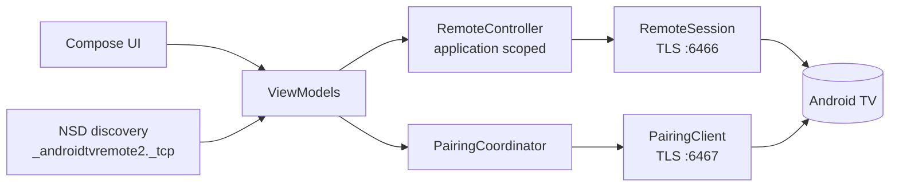

<div align="center">

# Free TV Remote

**A free, open-source Wi-Fi remote for Android TV and Google TV.**
No ads. No account. No cloud. No tracking.

[](https://github.com/tomerar/free-tv-remote/actions/workflows/ci.yml)
[](LICENSE)


[](CONTRIBUTING.md)

</div>

<!-- Add phone screenshots under fastlane/metadata/android/en-US/images/phoneScreenshots/ and show them here. -->
> *Screenshots: coming soon.*

Free TV Remote turns your phone into a remote control for any TV or streaming box that runs
**Android TV / Google TV**, using the same local-network protocol as Google's own remote app
(Android TV Remote protocol v2). Everything stays between your phone and your TV.

## Why this project exists

Controlling your own TV should not require an account, a cloud service, ads or Google Play Services.
This app is built to be small, private, auditable and friendly to F-Droid and to contributors.

> **Project status: early MVP.** The protocol implementation and the app are covered by automated tests
> against an in-process simulated TV. They have **not yet been validated on a broad range of real
> devices**; that is the most valuable thing the community can help with. See
> [Compatibility](#compatibility) and [TESTING.md](TESTING.md).

## Features

- **Find your TV** automatically on the Wi-Fi network (mDNS), or add it by IP address
- **Pair once** with the 6-character code shown on the TV; the TV's certificate is pinned afterwards
- **Full remote**: circular D-pad with OK, haptics and hold-to-repeat; Back, Home, Menu; volume and mute;
  power; play/pause, rewind and fast forward
- **Phone volume buttons** control the TV volume (optional)
- **Keyboard**: type on the phone, send the text to the TV
- **App shortcuts**: open Netflix, YouTube, Disney+, Prime Video and more through deep links, and add your own
- **Multiple TVs**: save several, switch with one tap, reconnect to the last used one automatically
- **Quick Settings tile** and **home-screen widget** for power and volume
- **Resilient**: reconnects with backoff, copes with TV standby, Wi-Fi loss and screen rotation
- **Accessible**: content descriptions, 48 dp touch targets, TalkBack-friendly D-pad
- **Localised**: English and Hebrew, with correct right-to-left layout (the D-pad always stays physically correct)
- **Themes**: system, dark or light

## Install

> **Step by step:** [docs/INSTALL.md](docs/INSTALL.md)

The quickest way, no account needed:

1. On your Android phone open the **[Releases](../../releases)** page and download the newest
   `FreeTVRemote-<version>.apk`.
2. Open the file. If Android asks, allow your browser / file manager to **install unknown apps**.
3. Tap **Install**, then open **Free TV Remote** and pair with your TV (see below).

| Source | Status |
| --- | --- |
| **GitHub Releases** (APK + SHA-256 checksum) | Signed with the project key; maintainers: [docs/RELEASING.md](docs/RELEASING.md) |
| **Latest development build** | The `debug-apk` artifact of the newest green [Actions](../../actions) run. Installable, but not update-compatible |
| **F-Droid** | Planned; the Fastlane metadata is already in [`fastlane/metadata/android`](fastlane/metadata/android) |
| **Build it yourself** | See [Building](#building) |

> **Updating:** the `v0.1.0` APK was signed with a one-off key and **cannot be updated in place**; uninstall it
> before installing a later release (you will pair your TVs again). Releases after it use a stable signing
> key and update normally. Development builds are never update-compatible. Details: [docs/INSTALL.md](docs/INSTALL.md#updating-and-the-v010-limitation).

Requires **Android 8.0 (API 26) or newer**. On Android 17 and newer, Android asks you to allow access to
devices on the local network; the app cannot work without that permission.

## Getting started: pair in three steps

1. Put the phone and the TV on the **same Wi-Fi network** and switch the TV on. Open the app and select
   your TV (or type its IP address).
2. The TV displays a **6-character code**. Enter it in the app.
3. Done. The app remembers the TV and reconnects by itself next time.

## Compatibility

Any device that implements the Android TV Remote protocol v2 (the one the Google TV app uses) should work:
Android TV and Google TV televisions, Chromecast with Google TV, and Android TV set-top boxes.

This table is **community maintained**. The protocol is only informally documented and vendors differ in
small ways, so every report helps. Please add yours with the
[Device compatibility report](../../issues/new?template=device_compatibility.yml) issue template
(include the *Android TV Remote Service* version, it matters).

| Device | Android TV / Google TV | Remote Service | Result | Notes |
| --- | --- | --- | --- | --- |
| Simulated TV (automated tests, `FakeTv`) | n/a | n/a | Passing | Verifies the implementation against itself, not against real firmware |
| *Your device here* | | | | [Report it](../../issues/new?template=device_compatibility.yml) |

Device-specific quirks we learn about are collected in the issues labelled `compatibility`.

## How it works



- **Pairing** (port 6467): TLS with a self-signed RSA client certificate generated on first launch. After the
  request / options / configuration handshake the TV shows a code; the app answers with
  `SHA-256(client key, TV key, code)`. The TV's public key is then **pinned**.
- **Remote session** (port 6466): TLS with the same certificate, the TV's pings are always answered, keys,
  deep links and text are sent as protobuf messages, and the link is re-established automatically.
- The session lives in an application-scoped controller, **never in a Composable**, so rotation and
  navigation cannot drop it.

The reasoning behind the main design choices is recorded in [DECISIONS.md](DECISIONS.md).

## Building

Requirements: JDK 17 or newer, Android SDK platform 37 and build-tools 36 (Android Studio installs them).

```sh
git clone https://github.com/tomerar/free-tv-remote
cd free-tv-remote

./gradlew assembleDebug     # app/build/outputs/apk/debug/
./gradlew check             # unit + UI tests, Android lint, ktlint, detekt
./gradlew :protocol:test    # the pure-JVM protocol module only
```

Release signing is optional. Put `storeFile`, `storePassword`, `keyAlias` and `keyPassword` in a
`keystore.properties` file (git-ignored), or set `SIGNING_STORE_FILE`, `SIGNING_STORE_PASSWORD`,
`SIGNING_KEY_ALIAS` and `SIGNING_KEY_PASSWORD`, then run `./gradlew assembleRelease`. Without them the
release APK is built unsigned (a partial configuration fails). Publishing a release requires the stable project key;
see [docs/RELEASING.md](docs/RELEASING.md).

### Repository layout

| Path | What is in it |
| --- | --- |
| [`protocol/`](protocol) | Pure Kotlin/JVM library with no Android dependency: protobuf schema (Wire), message framing, pairing secret, TLS identity and pinning, pairing client, remote session, and a `FakeTv` server used by tests |
| [`app/`](app) | The Android app: data stores, discovery, session controller, Jetpack Compose UI, tile and widget |
| [`fastlane/`](fastlane) | Store metadata (English, Hebrew) for F-Droid and Play |
| [`docs/`](docs) | Drafted starter issues |
| [`TESTING.md`](TESTING.md) | Manual test checklist for real devices |

## Quality

- Protocol: unit tests for the protobuf codec, framing, pairing secret and certificates, plus end-to-end tests
  over real TLS sockets against `FakeTv` (pairing, wrong code, rejection, keys, links, text, reconnect, silent
  TV, unreachable TV, changed certificate, forgotten pairing)
- App: tests for storage, session lifecycle, multi-TV handling, key gestures, and Compose tests for the D-pad
  in left-to-right and right-to-left layouts
- ktlint, detekt and Android lint run in CI on every push and pull request

## Roadmap

Ideas are tracked as issues; good starting points are listed in [docs/ISSUES.md](docs/ISSUES.md):
more translations (Weblate), more app presets, Wake-on-LAN, a touchpad mode, configurable repeat timing,
and golden-image screenshot tests.

## Contributing

Contributions of every size are welcome: device reports, translations, bug fixes, features and docs.
Read [CONTRIBUTING.md](CONTRIBUTING.md) and the [Code of Conduct](CODE_OF_CONDUCT.md), then pick a
[good first issue](docs/ISSUES.md). The one hard rule: **no proprietary, tracking or ad dependencies**,
so the app stays fully F-Droid compatible.

## Privacy and security

- Talks **only to your TV on the local network**; no analytics, ads, trackers, accounts or cloud services
- Does not use Google Play Services; permissions are limited to `INTERNET`, `ACCESS_NETWORK_STATE`,
  `ACCESS_WIFI_STATE` and, on Android 17+, `ACCESS_LOCAL_NETWORK`
- The client private key is encrypted with an Android Keystore key and excluded from backups; the TV is pinned
  after pairing

Found a vulnerability? Please follow [SECURITY.md](SECURITY.md) and report it privately.

## Credits

The Android TV Remote protocol is not officially documented. This project's wire structure and `.proto`
files are an original implementation. These community projects were consulted **for reference only**, and no
code was copied from them:

- [tronikos/androidtvremote2](https://github.com/tronikos/androidtvremote2) (Apache-2.0)
- [dgmltn/Dpad](https://github.com/dgmltn/Dpad)

Built with Kotlin, Jetpack Compose, [Wire](https://github.com/square/wire) and kotlinx.coroutines /
serialization. Code of Conduct adapted from the [Contributor Covenant](https://www.contributor-covenant.org).

## Disclaimer

Free TV Remote is an independent project and is **not affiliated with, endorsed by or sponsored by Google**
or any TV manufacturer. "Android", "Android TV", "Google TV", "Netflix" and other names are trademarks of their
respective owners and are used only to describe compatibility. No third-party logos are included.

## License

Copyright (C) the Free TV Remote contributors. Licensed under the **GNU General Public License v3.0 only**;
see [LICENSE](LICENSE).
