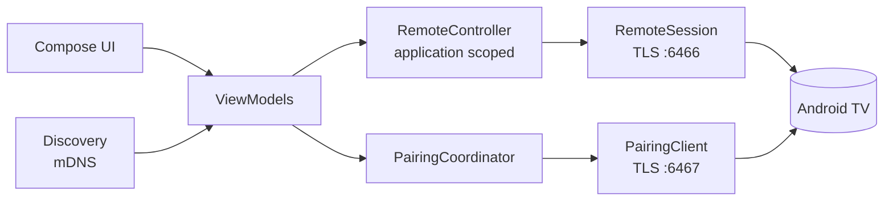

# Architecture

## Overview

Two modules:

- **`protocol`**: pure Kotlin/JVM, no Android dependency. Protobuf schema (Wire), message framing, the pairing
  secret, TLS identity and pinning, `PairingClient`, `RemoteSession`, and `FakeTv`, a simulated TV used by tests.
- **`app`**: the Android app. Storage (DataStore), discovery (`NsdManager`), `RemoteController`, view models,
  Jetpack Compose UI, tile, widget and diagnostics.

## The protocol (Android TV Remote v2)

The protocol is not officially documented. This project's wire structure and `.proto` files are an original
implementation written from observed behaviour and public community notes (see the credits in the README).

- **Pairing, port 6467.** TLS with a self-signed RSA client certificate generated on first launch. The client sends
  a request, then its options and configuration; the TV shows a 6-character code. The client answers with
  `SHA-256(client key, TV key, code)`; the TV's public key is then pinned.
- **Remote session, port 6466.** TLS with the same certificate. The TV pings regularly and **every ping must be
  answered** or the TV drops the link. Keys, deep links and text are protobuf messages. The TV reports its power
  state, volume, current app and text-field state through the same channel; the status card is built from these.
- **Discovery.** mDNS service `_androidtvremote2._tcp` through the platform `NsdManager` (legacy resolve API on
  Android 8-13, the callback API on 14+).

## Connection ownership

`RemoteSession` is **generation based**: every `start()` and `stop()` opens a new generation, and a connection
attempt may only touch shared state (the open socket, connection state, TV state) while its generation is still
current. An attempt that is still unwinding after `stop()` can therefore never close or overwrite a newer attempt's
state. This removed a class of reconnect races found in review. `RemoteController` owns the one active session in
the **application scope**, so rotation and navigation cannot drop it; it connects while the app is visible, keeps the
link 30 seconds after leaving, then disconnects to save battery.

## Threading rules that matter

- Sockets use blocking I/O on the IO dispatcher; on cancellation the socket is closed to unblock the reader.
- **A connected TLS socket is never closed on the main thread**: closing writes a close alert, which Android
  rejects on the main thread. `closeOffThread` handles this.
- Background failures in the application scope are recorded in the diagnostics log instead of crashing the app.

## UI state

View models expose `StateFlow`s; screens collect them lifecycle-aware. The status card, search screen and keyboard
sheet are stateless composables fed by pure functions (`AppName`, `volumeFraction`, `connectedMinutes`) so they are
unit-tested without a device. The search is a bounded job (`DiscoverViewModel`), the keyboard draft lives in a
controller that keeps text until a send succeeds, and key gestures (`REPEAT`, `TAP_OR_LONG`) are a plain coroutine
class tested with virtual time.

## Testing

| Layer | How it is tested |
| --- | --- |
| Protocol | Unit tests (codec, framing, pairing secret, certificates) and end-to-end tests over **real TLS sockets** against `FakeTv`: pairing, wrong code, rejection, keys, links, text, reconnect, silent TV, unreachable TV, changed certificate, forgotten pairing, session lifecycle ordering with deterministic hooks |
| App logic | Storage, multi-TV handling, key gestures, pairing coordinator, failure handling, search lifecycle, diagnostics log |
| UI | Robolectric Compose tests: D-pad in LTR and RTL, keyboard sheet, status card (closed, open, problems), 48 dp touch targets, navigation after pairing, localisation parity (English / Hebrew), plus screenshots |
| Real hardware | The checklist in [TESTING.md](../TESTING.md); results are recorded in [hardware-results/](hardware-results) |

**The honest limit:** `FakeTv` is written from the same assumptions as the client, so it cannot prove that real
vendor firmware agrees. That is why hardware results are kept separate and the compatibility claims in
[COMPATIBILITY.md](COMPATIBILITY.md) come only from them.

Design decisions and their reasons are in [DECISIONS.md](../DECISIONS.md).
